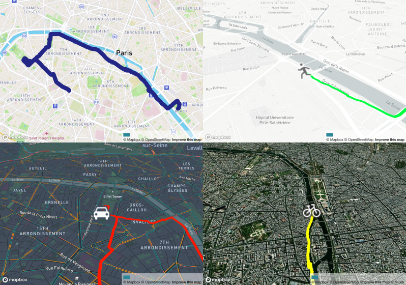

[](https://gpx.pelmers.com/)

## Website: [gpx.pelmers.com](https://gpx.pelmers.com)


### Description

GPX Replay takes your GPX file and replays it on a map. The tool runs entirely
on the client browser.

Repeat: **no data is sent to a server**. The GPX file is loaded into the
browser and processed on your computer.

Essentially it began as a subset of
[streetwarp-web](https://github.com/pelmers/streetwarp-web) that skipped the
video generation, then I added a bunch of things to it. The map uses the
[mapbox](https://www.mapbox.com) API. I made this tool to add map animations
to my [Eurovelo 6 video guide](https://www.youtube.com/watch?v=g8bpJm3dWoo).

### Features

-   Upload GPX file (track or route) and see it on a map
-   Replay the GPX file, allowing many custom settings



### Usage as Library

```
yarn add gpx-replay-react
```

```
import { MapComponent } from 'gpx-replay-react';

<MapComponent
    playbackFPS={30}
    mapboxAccessToken={mapBoxAccessToken}
    gpxInfo={{
        name,
        distance: {
            total: totalDistance,
        },
        points: [{lat: 10, lon: 10, ele: 0}, ...],
        sizeBytes: 1000,
    }}
    bindKeys
    showElevationProfile
/>
```

### New Features

-   Added elevation profile (via [boldtrn/Leaflet.Heightgraph](https://github.com/boldtrn/Leaflet.Heightgraph))
-   Published to npm as [`gpx-replay-react`](https://www.npmjs.com/package/gpx-replay-react)
